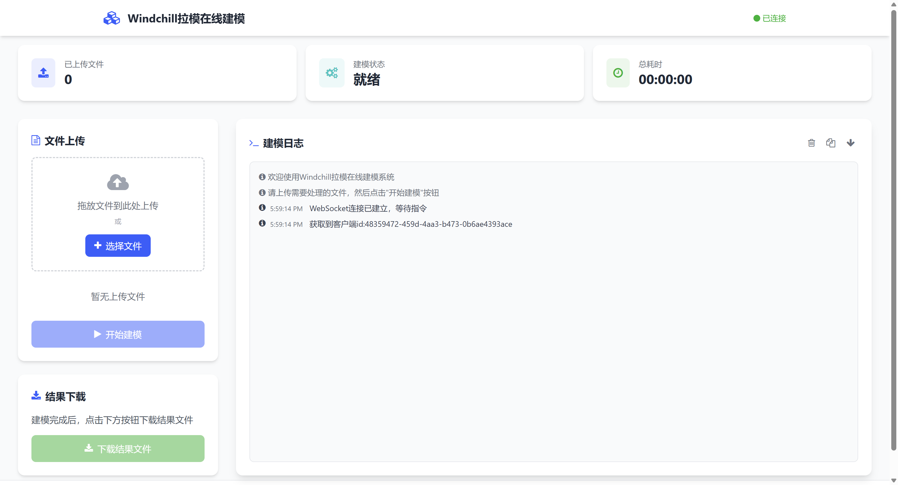

# Windchill 远程建模工具集

这是一套用于 Windchill 远程建模的工具集，支持通过 SSH/SFTP 远程执行 Windchill 建模相关的操作。目前只是勉强可用状态，可能会遇到一些问题需要自行解决。

**重要说明**：本工具集本身不提供建模服务，而是作为客户端工具调用远程的 Windchill 建模服务。您需要先有一个支持建模的 Windchill 服务器（通常部署在本地虚拟机中），然后通过本工具集连接到该服务器并执行建模操作。本工具集的主要作用是让调用建模服务更加方便和高效。



工具集包含以下功能：

- 远程目录准备
- 模型文件上传
- 代码和SQL生成
- 生成文件收集
- **Web在线建模服务**（新增）

## 功能特点

- 基于 SSH/SFTP 的远程操作
- 支持批量处理多个模型类
- 完整的错误处理和状态报告
- 模块化设计，支持独立运行或完整流程
- 统一的配置管理
- 彩色终端输出，提升可读性
- **Web在线建模平台**：提供基于 FastAPI 的 Web 服务，支持文件上传、实时日志查看和结果下载
- **实时日志推送**：通过 WebSocket 实时推送建模过程中的日志信息
- **任务管理**：支持多客户端连接，自动管理建模任务队列

## 系统要求

### 本地环境要求

- Python 3.6+
- 依赖包：
  - paramiko (SSH/SFTP 客户端)
  - colorama (终端彩色输出)
  - fastapi (Web 框架，用于在线建模服务)
  - uvicorn (ASGI 服务器，用于运行 FastAPI 应用)
  - python-multipart (文件上传支持)
  - jinja2 (模板引擎)

### 远程建模服务要求

- **必须有一个可访问的 Windchill 建模服务器**（这是本工具集工作的前提条件）
- 该服务器通常部署在本地虚拟机中，需要支持：
  - SSH/SFTP 连接（Windows 服务器需安装 OpenSSH Server，默认 shell 保持 cmd.exe）
  - Windchill 建模功能（ant 任务执行）
  - 文件系统读写权限

## 安装

### 方式一：直接使用源码（原用法，不变）

```bash
git clone https://gitee.com/happy0232/wind-modeling.git
cd wind-modeling
pip install -r requirements.txt
cd src
python remote_modeling_pipeline.py   # 或其它独立脚本 / modeling_server.py
```

### 方式二：作为 Python 包安装（供 windchill-cli 等调用）

```bash
pip install -e .                    # 开发：在本仓库根目录
# 或
pip install git+https://gitee.com/happy0232/wind-modeling.git
```

安装后可：

```python
from wind_modeling import ModelingSession, run_pipeline

session = ModelingSession(
    hostname="...", username="...", password="...",
    wt_home="/ptc/Windchill",
    local_root="../model", local_base="../dist",
    model_classes=["ext.app.Foo"],
)
print(run_pipeline(session))
```

独立脚本用法（编辑 `remote_modeling_config.py` 后在 `src/` 下运行）**保持不变**。

## 建模机列表配置（推荐，多机）

建模服务器通常固定几台，**与业务 Windchill / 项目无关**。复制仓库根目录：

```bash
cp modeling.servers.example.yaml modeling.servers.yaml   # 已 gitignore，填入真实密码
# 或: 设置环境变量 WIND_MODELING_SERVERS=/path/to/modeling.servers.yaml
```

```python
from wind_modeling import build_session_from_config, list_modeling_servers, run_pipeline

print(list_modeling_servers())  # 密码打码
server, session = build_session_from_config(
    "lab-wc11",  # 或 None 用 default
    model_classes=["ext.app.Foo"],
    local_root="../model",
    local_base="../dist",
)
print(run_pipeline(session))
```

> **windchill-cli**：当前 `wc model` 仍读自身 `config.yaml` 的 `modeling` 段；**建议后续改为共用本文件**，避免两套凭据。

## 配置（旧：单机脚本）

编辑 `src/remote_modeling_config.py` 文件配置连接信息（独立脚本仍可用）：

### Windchill连接配置（连接Windchill建模服务）

**重要**：`SSH_CONFIG` 中的 `hostname` 配置的是**Windchill建模服务的地址**，通常情况下，这是部署在本地虚拟机中的 Windchill 服务地址。

```python
# SSH连接配置 - 连接到Windchill建模服务
SSH_CONFIG = {
    'hostname': 'your-server.com',  # 建模服务地址（通常是本地虚拟机中的Windchill服务器地址）
                                    # 例如：'192.168.1.100' 或 'windchill-vm.local'
    'username': 'your-username',    # SSH用户名（用于连接建模服务器的SSH账户）
    'password': 'your-password',    # SSH密码
    'port': 22,                     # SSH端口（默认22）
    'timeout': 60,                  # 超时时间(秒)
    'platform': None                # 远程服务器平台: 'linux' / 'windows'
                                    #   None(默认)/留空 = 连接后自动探测
                                    #   Windows 需已安装 OpenSSH Server，默认 shell 保持 cmd.exe
}
```

**配置说明**：
- `hostname`：**建模服务地址**，通常是本地虚拟机中 Windchill 服务器的 IP 地址或主机名
  - 示例：`'192.168.1.100'`（虚拟机IP）
  - 示例：`'windchill-vm.local'`（虚拟机主机名）
  - 示例：`'localhost'`（如果建模服务在同一台机器上）
- `username`：用于 SSH 连接的用户名，需要有权限访问 Windchill 安装目录和执行 ant 任务
- `password`：SSH 连接密码
- `port`：SSH 服务端口，默认 22
- `timeout`：连接超时时间，建议设置为 60 秒或更长

### 路径配置

```python
# 路径配置
MODELING_CONFIG = {
    'wt_home': '/path/to/windchill',  # 远程建模服务器上Windchill的安装目录
                                      # 例如：'/ptc/Windchill_11.0/Windchill'
                                      # Windows: 'C:/ptc/Windchill_11.0/Windchill'
    'local_base': '../dist',          # 下载文件的本地基目录（相对于工具运行目录）
    'local_root': '../model'          # 上传文件的本地根目录（相对于工具运行目录）
}
```

**配置说明**：
- `wt_home`：**远程建模服务器**上 Windchill 的安装路径（不是本地路径）
- `local_base`：本地用于存储下载文件的目录
- `local_root`：本地用于存储上传文件的目录

### 模型类配置
#### 执行脚本的时候在这里配置需要拉模的包路径，如果是通过Web操作则不想要这一步

```python
# 执行脚本的时候在这里配置需要拉模的包路径
MODEL_CLASSES = [
    'ext.app.process.model.YourModel',
    # 添加更多模型类...
]
```

## 使用方法

### 1. 独立运行各个工具

准备远程目录：
```bash
python remote_modeling_prepare.py
```

上传模型文件：
```bash
python remote_modeling_upload.py
```

生成代码和SQL：
```bash
python remote_modeling_generator.py
```

收集生成的文件：
```bash
python remote_modeling_collector.py
```

### 2. 运行完整流程

执行完整的建模流程（按顺序执行所有步骤）：
```bash
python remote_modeling_pipeline.py
```

### 3. 启动Web在线建模服务

启动基于 FastAPI 的 Web 服务，提供在线建模功能：
```bash
python modeling_server.py
```

服务启动后，访问 `http://localhost:8000` 即可使用 Web 界面进行建模操作。

**Web服务功能：**
- 通过浏览器上传模型文件
- 实时查看建模日志
- 下载建模结果（ZIP格式）
- 支持多任务管理

## 工具说明

### remote_modeling_prepare.py
- 功能：创建必要的远程目录结构
- 为每个模型类创建 src、src_gen、codebase 和 db/sql3 目录

### remote_modeling_upload.py
- 功能：上传模型文件到服务器
- 支持递归上传
- 自动创建远程目录

### remote_modeling_generator.py
- 功能：生成模型相关的代码和SQL
- 执行 Windchill ant 任务
- 支持批量处理多个模型类

### remote_modeling_collector.py
- 功能：下载生成的文件到本地
- 保持远程目录结构
- 彩色输出下载状态

### remote_modeling_pipeline.py
- 功能：串联所有操作的主入口
- 按顺序执行所有步骤
- 出错时立即停止并报告

### modeling_server.py
- **功能**：提供基于 FastAPI 的 Web 在线建模服务（**注意：仍需要依赖远程建模服务**）
- **主要特性**：
  - Web 界面：提供友好的 Web 界面进行建模操作，让调用远程建模服务更加方便
  - 文件上传：支持通过 HTTP POST 上传模型文件（支持多文件）
  - 实时日志：通过 WebSocket 实时推送建模过程中的日志信息
  - 任务管理：自动生成任务ID，支持多客户端连接，同一时间只允许一个任务执行
  - 结果下载：将建模结果打包为 ZIP 文件供用户下载
  - 日志记录：所有操作日志自动保存到 `modeling.log` 文件
- **依赖说明**：
  - Web 服务本身不提供建模功能，它只是提供了一个更方便的调用方式
  - 底层仍然需要通过 SSH 连接到远程建模服务器（配置在 `remote_modeling_config.py` 中）
  - 建模任务实际在远程服务器上执行，Web 服务负责文件传输、日志收集和结果下载
- **API端点**：
  - `GET /`：Web 主页界面
  - `POST /upload`：上传模型文件（需要 client_id 和 task_id 参数）
  - `GET /download`：下载建模结果（需要 task_id 参数）
  - `GET /create_task`：创建新任务，返回任务ID
  - `WebSocket /ws`：WebSocket 连接，用于实时日志推送和任务控制
- **工作流程**：
  1. 客户端通过 WebSocket 连接获取 client_id
  2. 调用 `/create_task` 创建任务，获取 task_id
  3. 通过 `/upload` 上传模型文件
  4. 通过 WebSocket 发送建模指令（action: "modeling"）
  5. 服务器自动解析上传的文件，提取 Java 类路径
  6. 执行建模流程，实时推送日志
  7. 建模完成后，通过 `/download` 下载结果
- **技术实现**：
  - 使用 FastAPI 构建 RESTful API 和 WebSocket 服务
  - 自定义标准输出流，实现日志的实时推送和文件记录
  - 异步任务处理，避免阻塞事件循环
  - 自动任务隔离，每个任务使用独立的目录结构

## 错误处理

- 所有工具都提供详细的错误信息
- 完整流程中任何步骤失败都会立即停止
- 错误信息包含具体的失败原因和位置

## 注意事项

### 前置条件

1. **必须有一个可用的远程建模服务**：
   - 确保您已经有一个部署好的 Windchill 建模服务器（通常在本地的虚拟机中）
   - 该服务器必须支持 SSH/SFTP 连接
   - 该服务器必须已安装并配置好 Windchill，能够执行建模相关的 ant 任务

2. **网络连接**：
   - 确保本地环境能够通过 SSH 连接到远程建模服务器
   - 如果建模服务器在虚拟机中，确保虚拟机的网络配置正确（桥接模式或 NAT 模式）
   - 测试连接：`ssh username@hostname` 应该能够成功连接

### 配置注意事项

3. **SSH 连接配置**：
   - `hostname` 必须配置为**建模服务器的实际地址**（IP 或主机名）
   - 确保 SSH 用户名和密码正确
   - 确保 SSH 用户有权限访问 Windchill 安装目录和执行 ant 任务

4. **Windchill 环境配置**：
   - `wt_home` 必须是**远程服务器**上 Windchill 的实际安装路径
   - 确保该路径在远程服务器上存在且可访问

5. **本地目录权限**：
   - 本地目录（`local_base` 和 `local_root`）需要有写入权限
   - 建议使用相对路径，工具会自动创建目录

### 使用建议

6. **测试建议**：
   - 建议先小规模测试再处理大量文件
   - 可以先测试 SSH 连接：`python -c "from remote_modeling_config import SSH_CONFIG; print(SSH_CONFIG)"`
   - 建议先运行单个工具测试，再运行完整流程

7. **Web 服务注意事项**：
   - Web 服务启动后，仍然需要通过 SSH 连接到远程建模服务器
   - Web 服务只是提供了更方便的调用方式，底层仍然依赖远程建模服务

## 开发计划

- [ ] 添加进度条显示
- [ ] 支持文件过滤（按日期/类型）
- [ ] 添加 MD5 校验
- [ ] 实现增量上传
- [x] 添加日志记录功能（已实现）
- [x] Web在线建模服务（已实现）

## 贡献

欢迎提交 Issue 和 Pull Request！

## 许可证

MIT License 